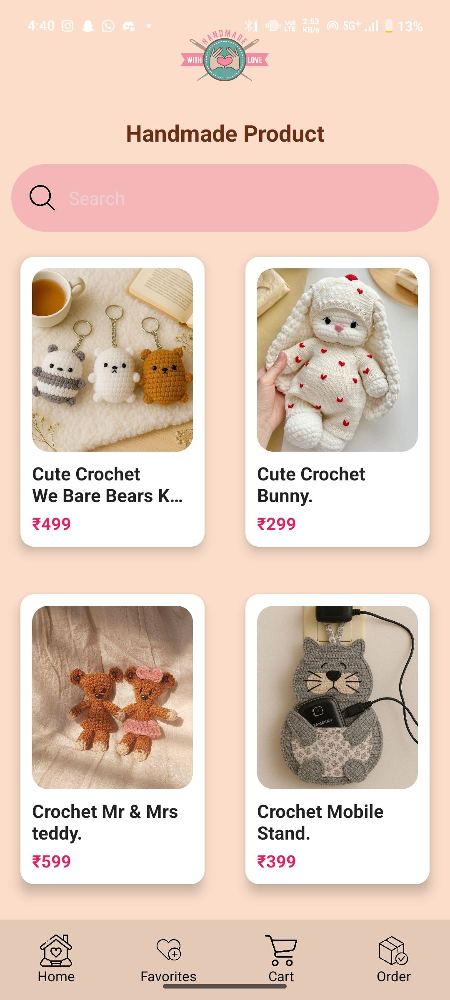

# handmade-e-shopping-app 🛍️

An Android e-commerce application built using **Java** and **Firebase** for handmade product shopping.

## 🚀 Features
- Firebase Authentication
- Real-time Firestore Database
- Product Listing & Details
- Add to Cart & Checkout
- Order History & Tracking
- Real-time Stock Management
- Favorites Feature
- Comments & Reviews (Real-time)
- Admin Panel for Product & Stock Updates
- Live Product Preview Feature

## 🛠️ Tech Stack
- Android Studio
- Java, XML
- Firebase Auth
- Firebase Firestore
- RecyclerView
- Glide

## 📸 Demo / Screenshots
## 📸 App Screenshots

### 🔐 User Authentication (Sign Up)

---

### 🏠 Home Screen

---

### 🛍️ Products Listing

---

### 📄 Product Details

---

### 🛠️ Admin Panel

## 🔐 Source Code Access
Full source code and advanced modules are **paid**.

📲 Contact on WhatsApp: **7385689102**

## 👨‍💻 Developer
Anuj Ramjiyani  
Android App Developer
